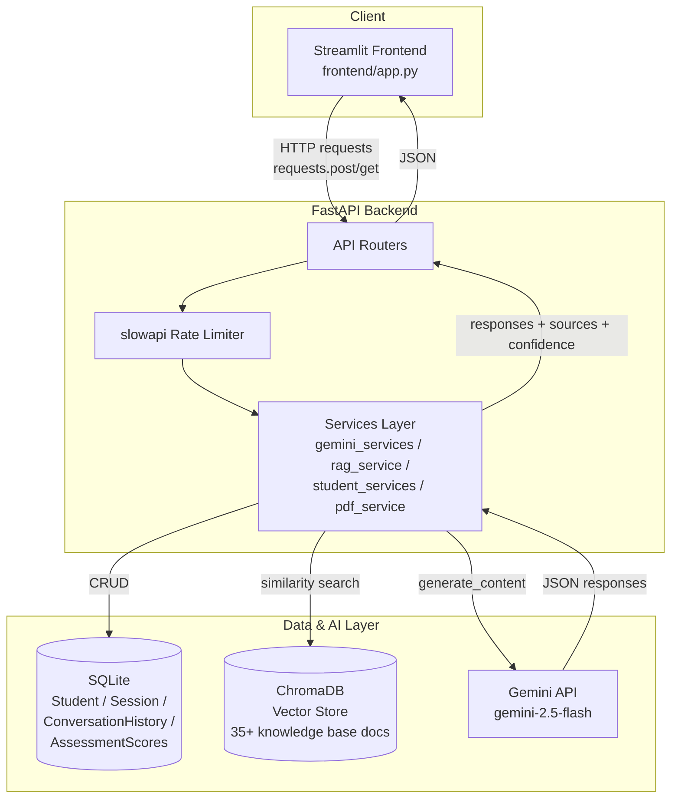
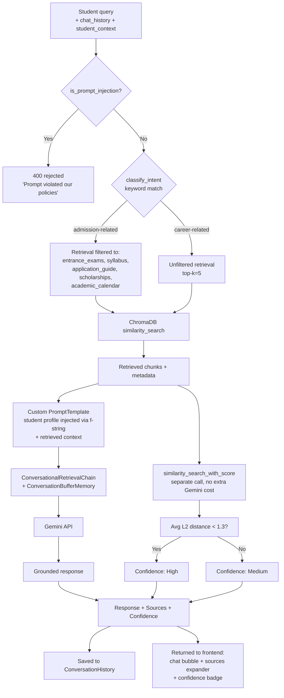
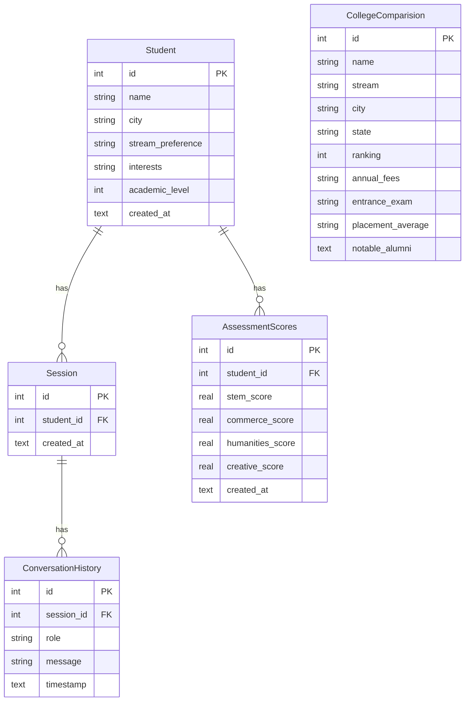

# Technical Architecture

This document describes the system architecture of the AI Career Guidance & Admission Intelligence Platform: its major components, the RAG pipeline that powers the career guidance chatbot, and the database schema.

---

## 1. System Component Diagram

**Key points:**
- The frontend never talks to Gemini, ChromaDB, or SQLite directly — all access goes through the FastAPI backend, keeping the API key and data layer server-side only.
- `slowapi` rate limiting sits in front of the four Gemini-cost endpoints (`/api/recommend/stream`, `/api/recommend/degrees/{id}`, `/api/roadmap/{student_id}`, `/api/chat/rag`).
- Streamlit-side `st.cache_data` caches recommendation/roadmap responses per student for 24h; FastAPI-side `lru_cache` caches the (largely static) colleges endpoint. Analytics is deliberately left uncached since it reflects live usage data.

---

## 2. RAG Pipeline Diagram

**Key design decisions:**
- **Defense in depth against prompt injection:** a keyword filter rejects known injection phrases before any Gemini call; the prompt itself is also reinforced to redirect off-topic/role-override attempts that slip past the filter.
- **Intent-based retrieval filtering** avoids surfacing irrelevant admission documents for career questions and vice versa.
- **Confidence scoring** required restructuring away from `ConversationalRetrievalChain`'s default relevance-score method (miscalibrated for this Chroma collection's L2 distance metric) to a raw-distance threshold empirically derived by comparing on-topic vs. off-topic query distances (average distance < 1.3 → High).
- **Student personalisation** is injected via plain string interpolation into the prompt template rather than as extra `chain.invoke()` keys, because `ConversationalRetrievalChain`'s memory component only supports a single top-level input key.

---

## 3. Database Schema

**Indexing:** `Session.student_id`, `ConversationHistory.session_id`, `AssessmentScores.student_id`, and `Student.stream_preference` are indexed to keep lookups fast as student volume grows (added in W10.1). `CollegeComparision` has no foreign key to `Student` — it is static reference data, not linked per-student.

**Note:** `CollegeComparision` is intentionally excluded from the entity relationships above since it has no foreign key link to `Student` — it's standalone seed data queried directly with filters (stream, state, max fee) rather than joined against student records.
