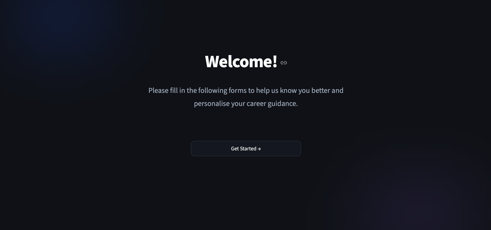
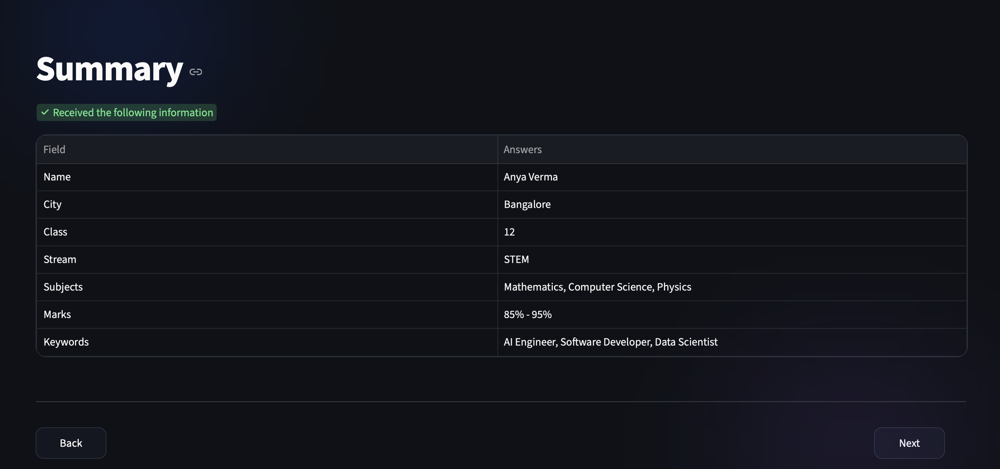
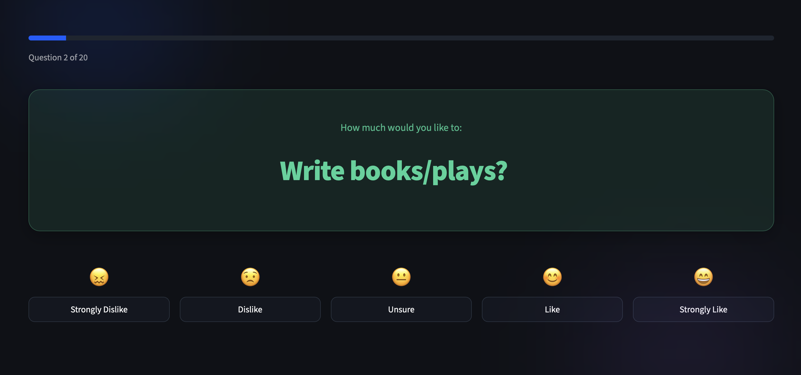
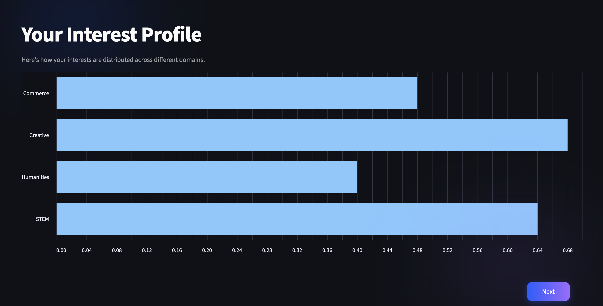
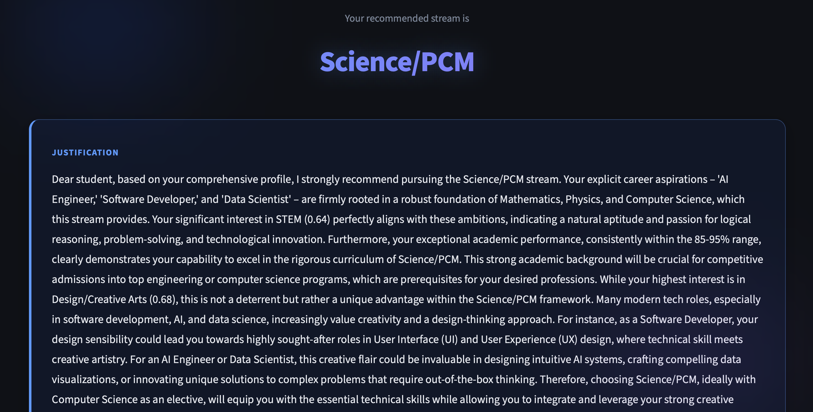
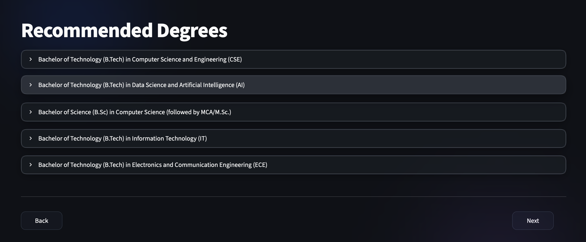
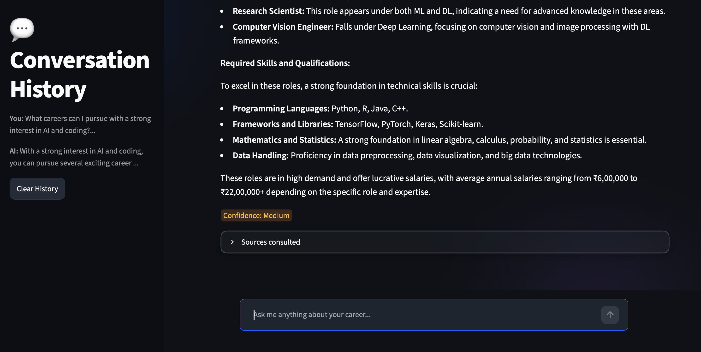
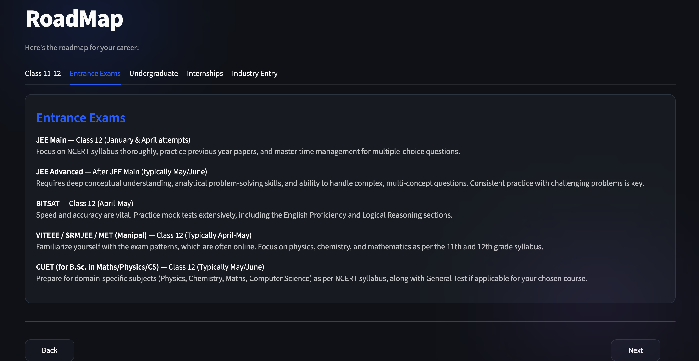
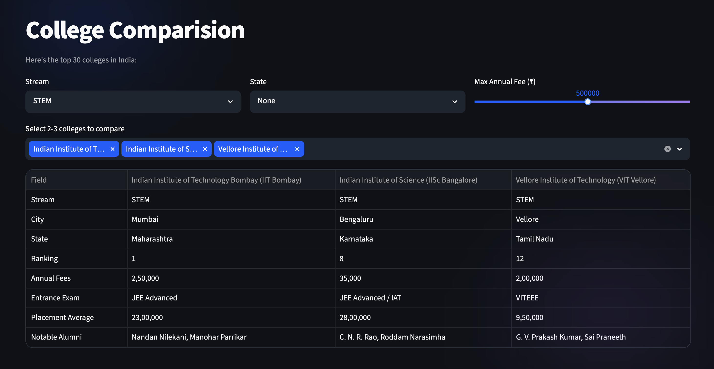
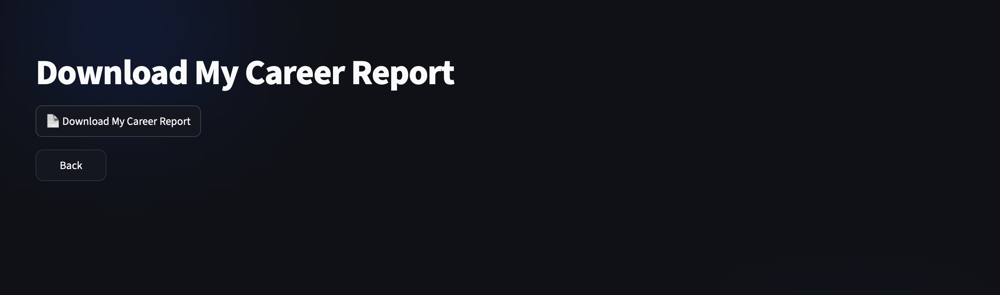

# AI Career Guidance & Admission Intelligence Platform

An AI-powered EdTech platform that helps Class 12 students in India navigate stream selection, degree guidance, admission intelligence, and career planning — powered by the Gemini API, a Retrieval-Augmented Generation (RAG) pipeline, and a FastAPI + Streamlit architecture.

Built by **Aryan Ajmera** as part of the NextGen Forge Technologies AI/ML Internship Program (Ref: NFGT/HR/INT/2026/160).

---

## Live Demo

- **Frontend (Streamlit):** _coming soon_
- **Backend API (FastAPI + Swagger docs):** _coming soon_

---

## Project Overview

Career confusion among Class 12 students is one of the most common challenges in the Indian education system — generic aptitude tests and expensive counselling leave most students without personalised, data-driven guidance. This platform addresses that gap with an end-to-end AI advisory system that:

- Assesses a student's interests through a 20-question, weighted assessment
- Recommends a stream (Science/PCM, Science/PCB, Commerce, Humanities) with a Gemini-generated, personalised justification
- Recommends degree pathways, entrance exams, and career trajectories
- Answers open-ended career and admission questions through a RAG-powered chatbot grounded in a curated knowledge base of 30+ documents, with source attribution and confidence scoring
- Generates a personalised, multi-stage career roadmap
- Compares 30 Indian colleges by stream, fees, ranking, and placements
- Produces a downloadable, personalised PDF career report

---

## Tech Stack

| Technology | Purpose |
|---|---|
| Python 3.10+ | Core language |
| Streamlit | Student-facing frontend UI |
| FastAPI | REST API backend |
| Gemini API (`gemini-2.5-flash`) | Generative AI for recommendations, roadmaps, and chat |
| LangChain (`ConversationalRetrievalChain`, `ConversationBufferMemory`) | RAG orchestration and conversational memory |
| ChromaDB | Vector database for knowledge base retrieval |
| SQLite | Student profiles, sessions, conversation history, assessment scores |
| Pandas & NumPy | Data processing |
| PyPDF | Knowledge base PDF ingestion and chunking |
| ReportLab + Matplotlib | PDF career report generation with charts |
| slowapi | API rate limiting |
| Render | Cloud deployment (backend + frontend as separate services) |

---

## Feature List

| # | Feature | Notes |
|---|---|---|
| 1 | Student onboarding & profile system | Multi-step form, stored in SQLite |
| 2 | Interest & aptitude assessment | 20 questions, 4 domains, normalised interest vector |
| 3 | AI stream recommendation | Gemini-generated, personalised justification, cached |
| 4 | Degree & career path recommendations | Top 5 degrees, career pathways, entrance exams, timelines |
| 5 | RAG-based career guidance chatbot | Grounded in 35+ document knowledge base, intent-classified retrieval (career vs. admission) |
| 6 | Source attribution & confidence indicator | Shows consulted documents; High/Medium confidence via retrieval distance threshold |
| 7 | AI career roadmap generation | Class 11–12 through industry entry, tab-based UI |
| 8 | Admission intelligence | JEE, NEET, CUET, CLAT, CAT syllabi, timelines, scholarships |
| 9 | College comparison | 30 Indian colleges, filterable by stream/state/fee |
| 10 | Conversation history | Persisted per session, LangChain memory-backed |
| 11 | PDF career report | ReportLab + Matplotlib, downloadable, branded |
| 12 | Admin analytics dashboard | Usage metrics, interest distribution, session counts |
| 13 | Performance optimisation | Streamlit + FastAPI caching, SQLite indexes |
| 14 | Security hardening | Prompt injection defense (keyword filter + reinforced prompts + length limits), rate limiting, env var audit |

---

## Screenshots

| Onboarding | Profile Summary | Assessment |
|---|---|---|
|  |  |  |

| Interest Profile | Stream Recommendation | Degree Recommendations |
|---|---|---|
|  |  |  |

| RAG Chatbot | Career Roadmap | College Comparison |
|---|---|---|
|  |  |  |

| PDF Report Download |
|---|
|  |

## Folder Structure

```
NextGenForge/
├── frontend/              # Streamlit app, UI helpers, styling
│   ├── app.py
│   ├── ui_helpers.py
│   ├── assessment_styles.py
│   └── recommendation_ui.py
├── backend/
│   ├── main.py             # FastAPI entrypoint
│   ├── limiter.py          # Shared slowapi rate limiter
│   ├── routers/            # API route definitions
│   ├── services/           # Business logic (Gemini, RAG, students, PDF, etc.)
│   ├── schemas/             # Pydantic request/response models
│   ├── models/             # SQLite table + index definitions
│   └── database/           # DB connection helper
├── data/                   # Assessment question bank, college seed data
├── knowledge_base/         # RAG source PDFs (35+ documents)
├── chromadb_store/          # ChromaDB vector store (gitignored)
├── ProgressReports/         # Weekly progress reports
├── render.yaml              # Render Blueprint deployment config
├── Procfile                  # Supplementary process definitions
├── requirements.txt
├── .gitignore
└── README.md
```

---

## Prerequisites

- Python 3.10 or higher
- A Gemini API key from [Google AI Studio](https://aistudio.google.com/)

---

## Setup Instructions

1. **Clone the repository**
   ```bash
   git clone https://github.com/AryanLovesCoding/NextGenForge
   cd NextGenForge
   ```

2. **Create and activate a virtual environment**
   ```bash
   python -m venv venv
   source venv/bin/activate
   ```

3. **Install dependencies**
   ```bash
   pip install -r requirements.txt
   ```

4. **Configure environment variables**

   Create a `.env` file in the project root:
   ```
   GEMINI_API_KEY=your_gemini_api_key_here
   ```

5. **Create the database tables**
   ```bash
   python -m backend.models.create_tables
   ```

6. **Ingest the knowledge base** (required for the RAG chatbot)
   ```bash
   python -m backend.services.knowledge_base_service
   ```

7. **Run the backend**
   ```bash
   uvicorn backend.main:app --reload
   ```

8. **Run the frontend** (in a separate terminal)
   ```bash
   cd frontend
   streamlit run app.py
   ```

9. Open the Streamlit URL shown in your terminal (typically `http://localhost:8501`).

---

## Environment Variables

| Variable | Description |
|---|---|
| `GEMINI_API_KEY` | Gemini API key from Google AI Studio |
| `DATABASE_URL` | (Production/Render only) Path to the SQLite database |
| `CHROMA_PERSIST_DIR` | (Production/Render only) Path to the ChromaDB store |

---

## API Reference Summary

Full interactive documentation is available at `/docs` (Swagger UI) once the backend is running.

| Endpoint | Method | Description | Rate Limit |
|---|---|---|---|
| `/api/students` | POST | Create a student profile | — |
| `/api/students/{id}` | GET | Retrieve a student profile | — |
| `/api/recommend/stream` | POST | Get AI stream recommendation | 5/min |
| `/api/recommend/degrees/{id}` | GET | Get degree recommendations | 5/min |
| `/api/chat/rag` | POST | RAG-powered chatbot with source attribution + confidence | 10/min |
| `/api/roadmap/{student_id}` | GET | Generate career roadmap | 5/min |
| `/api/colleges` | GET | List/filter colleges (stream, state, max fee) | — (cached) |
| `/api/analytics/summary` | GET | Admin analytics dashboard data | — |
| `/api/report/{student_id}` | GET | Download personalised PDF report | — |

---

## Known Limitations

- **Ephemeral storage on Render's free tier:** without a persistent disk or managed database, SQLite student data and the ChromaDB vector store reset on service restart/redeploy. A production deployment would use a managed database (e.g. Render Postgres) and object storage for the vector index.
- `Career_in_agriculture.pdf` in the knowledge base is a scanned/image-based PDF and contributes zero extractable chunks — documented as a known ingestion limitation rather than silently ignored.
- The non-RAG chatbot endpoint (`/api/chat`) is retained as a lightweight fallback path but is not currently wired into the frontend.

---

## Internship Details

| Field | Detail |
|---|---|
| Candidate | Aryan Ajmera |
| Reference Number | NFGT/HR/INT/2026/160 |
| Company | NextGen Forge Technologies |
| Domain | AI/ML Engineering |
| Industry Guide | Aryan Sharma |
| Reporting Manager | Sonia Sharma |